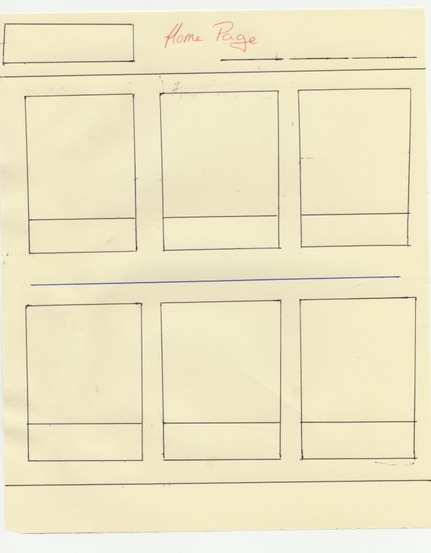
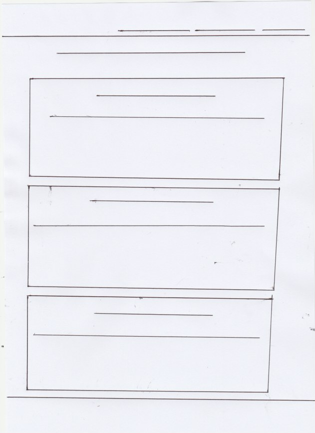
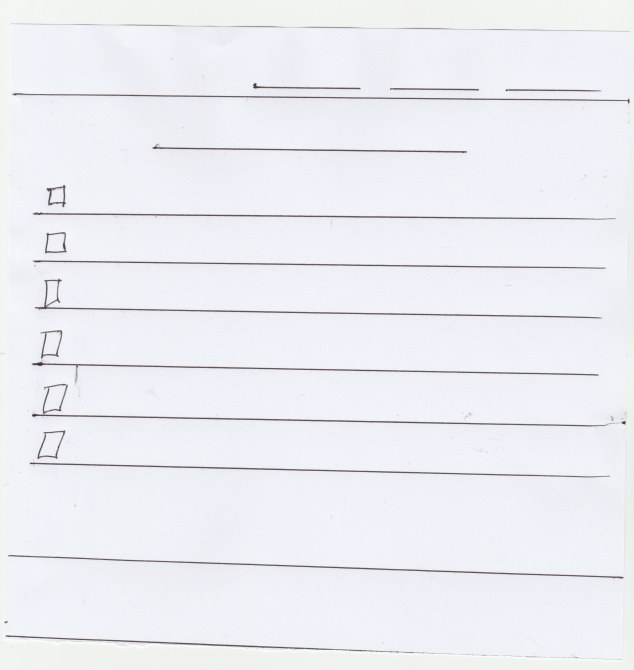
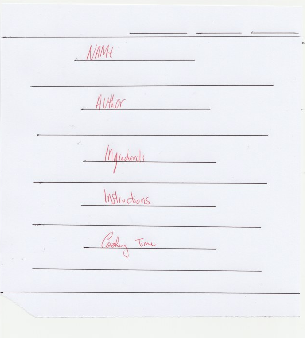

HotPot’s Cook Book
===

**Milestone Project Three: Data Centric Development - Code Institute.**

HotPot’s is an online cookbook dedicated to allowing users to display and share their recipes with people from all over the world. The site is category-focused and highlights recipes based on attributes such as cuisine, cooking ability and meal type. The user can structure, create and edit their recipes to their preference and store recipes on the site for other users to view. HotPot’s is an opportunity for users to see the joy of cooking and to understand that making something great can be very simple. After all, anyone can cook!

Through a series of colorful and easy-to-navigate webpages, the user can assess and decide which recipe they want to make. Most importantly, HotPot’s is user inclusive. Whether the user wishes to interact and add a recipe, or simply browse and view what’s available from other members, there’s something for everyone looking to make their meal great!

UX
---
HotPot’s was created as an opportunity to connect the culinary arts with the resourcefulness of the web. It’s mainly intended for any user looking to find and share recipes with and from people all over the world. By using various criteria to measure and group certain recipes together, the site presents a wide variety of cuisines aimed at a wide variety of users from beginner to expert with different culinary skills and interests. HotPot’s is very much a learning resource for the promotion, education and encouragement of users to take risks and venture into the cooking world whether experienced or not. 

Whether a user is looking for a specific recipe or unsure where to start, the **Home Page** immediately presents numerous options for what’s available on the site. The Home Page presents the categorization of recipes by Meal Type, Cuisine Style and Cooking Ability. By condensing these choices into groups, the user can better inform their decision of where to start their journey without intimidation or frustration. For example, a user who is also a beginner and interested in Italian cooking may choose to click "Easy Recipes" or, alternatively, can see what’s available in the “Italian” section of cuisine. By contrast, a long-time chef looking for something challenging may try their hand at something from the “Expert” section, or try a new cuisine such as “French” cooking. The Home Page presents these groups of choices to entice and encourage any user to see the possibilities of what’s available.

Once a user decides which category they want to try and have clicked the link at the bottom of the card, the user will be brought to a new menu with a library of every recipe relevant to that group presented alphabetically for their consideration. Every menu on the site presents the user with a number of  different blue recipe cards that include the title and author of the recipe, a brief description of that recipe, and a few small details such as cuisine style and serving size of the recipe. Each card also includes a **View Recipe** button to view the entire recipe. If a user is logged in, they will also be presented with an Edit and Delete option for every recipe along with the View.

Once the user has chosen their recipe and clicked the **View Recipe** link, they will be presented with the full recipe information including instructions and ingredients to follow along with as they cook their desired recipe. The recipes are presented in a very easy to follow format using larger font and clear, straight-forward information.

To share a recipe with the site, the user must first use the **Sign Up!** button to register with HotPot’s. Sign Up requires a Username, Email Address and Password.  The user can then Log In with their username. While logged in, their username will welcome them on every page of the site’s navigation bar and will also act as a Home Page button should the user get lost. 

If a user wishes to add a recipe to the site, the user must click the **Add a Recipe!** Button which takes them to a structured form which will prompt them for all necessary recipe components before their recipe is published to the site. Criteria for adding a recipe includes correct ingredients, cooking instructions, preparation and cooking times as well as any allergens, serving size and calorie count. Once these criteria are satisfied, the user’s recipe will then be published to the site’s main Recipes Menu, which includes every recipe the site has to offer, as well as being grouped with relevant other menus on the site through the criteria provided.

If a user wishes to find a recipe alphabetically by either recipe name or author’s name, the **Recipes Menu** as described above will provide them with filtered libraries to satisfy this need.

For users who feel their recipe can be improved or wish to make changes to the information they provided, HotPot’s also provides an **Edit Recipe** option which is linked with every recipe card that is created. Once clicked, the user will be brought to a form similar to the one used for Add a Recipe! However, the input prompt will this time include all information previously provided for the recipe’s creation for the user to edit. Once the necessary changes are made and the user is happy, they may submit their changes and the recipe’s new detail will appear accordingly.

Users unhappy with recipes on the site can also delete them using the **Delete Recipe** link also provided on every recipe card created on the site. Every delete is permanent and the recipe will not be retrieved if the option is clicked.

You can find mockups of how this project was planned and envisioned to look below and also in my GitHub under the **mockups** folder.

**Home Page**

**Recipes Menu**

**Add A Recipe!**

**View Recipe**

Features
---

In this section, I will briefly describe each user available feature which this project has to offer.

**Existing Features**

* **Navigation bar** – Allows users to navigate between web pages on the site using marked buttons.
* **Home Page Cards** – Another way for users to navigate the site, but each card includes an image and each link is specific to a different variety of recipes they can view. The varieties include Recipes by Meal Type, Recipes by Cuisine and Recipes by Ability.
* **Sign Up!** – A page which prompts the user for their email address, username and password to register them for the site.
* **Log in** – A page which prompts the user for their username. Log in is required for users to avail of certain features on the site.
* **Log In Failure** - A courtesy page which will notify a user of their log in failure. Includes a hyperlink back to the log in page. 
* **Username icon** – A neat little icon of the user’s username which will appear on the right hand side of the navbar to welcome the user when they successfully log in. It will also bring the user back to the home page when clicked.
* **Recipe Menu** – A list of every recipe available to view on the site. The list is organised alphabetically by Recipe Name and Author’s Surname.
* **Recipe Cards** – These cards appear on all Recipe Menus. They are coloured blue and they give a brief synopsis of the recipe that include Title, Author, Description, Meal Category, Cuisine, Difficulty and Serving Portion. Depending on whether or not a user is logged in, the choices for each card can differ from simply viewing the recipe or, if logged in, the ability to edit and delete that recipe.
* **View Recipe** – One of the Recipe Card options which allows the user to view a webpage with the full details of the Recipe Card they clicked including Ingredients and Instructions.
* **Add A Recipe!** – A navigation button which will bring a logged in user to a form for adding a recipe to the site. The form Requires each field to be filled out and is validated at certain marks to make sure the recipe satisfies all requirements necessary to be added to the site.
* **Edit a Recipe** – A feature of the Recipe Card. Edit a Recipe is similar to the Add a Recipe! feature, except this form allows the user to improve an existing recipe on the site. Every detail of the recipe will appear in the prompt and the user can make adjustments where necessary.
* **Delete Recipe** – A feature of the Recipe Card. Delete a recipe allows a user to permanently delete a recipe from the database.

**Features Left to Implement**
* I hope to implement a feature which will allow users to upload their own images to display alongside their recipes. I believe it will make the user experience more personal and rewarding to share images of what they have cooked alongside recipes.
* I also hope to give the users the opportunity to upvote recipes and have those votes stored on the MongoDB. As of writing this, I haven’t found the solution to properly coding this function, but I hope to make it part of the site soon.
* I would also like to implement a more secure authentication system which uses password and this feature will also be rectified in the future.

Technologies Used
---

The following list contains all technologies used in the creation of this project.

* **Cloud9**
  * Platform used to write the necessary code for this project. Link for the official site provided [here]( https://c9.io/login).

* **Python**
  * The programming language used on this project. Link for the official site provided [here](https://www.python.org/).

* **Flask**
  * MicroFramework used along with Python. Allows all applications to be routed to the browser. Link for the official site provided [here](http://flask.pocoo.org/).

* **MongoDB**
  * Used for data storage. Link for the official site provided [here]( https://mlab.com/).

* **PyMongo**
  * Used to allow Python to communicate with MongoDB in retrieving necessary data. Link provided [here]( https://api.mongodb.com/python/current/).

* **BSON**
  * BSON was used to read ObjectIds from MongoDB as JSON.

* **Ginja**
  * Used to incorporate Python code in an HTML file setting.

* **JQuery**
  * The project uses JQuery to initialize the Materialize elements used. It was also used for the form validation. Link for the official site provided [here](https://jquery.com/).

* **HTML**
  * The project uses HTML as the mark-up language.

* **CSS**
  * The project uses CSS to style the HTML elements.

* **Bootstrap**
  * A Bootstrap CDN was initially used to add further style to the project. However, I later decided to solely use the Materialize library. Link for the official site provided [here](https://getbootstrap.com/).

* **Font Awesome**
  * Used to add visual icons for the form sections of the project. Link for the offical site provided [here](https://fontawesome.com/).

* **Google Fonts**
  * Used to add a specific font to certain sections of HTML text. Link for the offical site provided [here](https://fonts.google.com/).

* **Materialize**
  * Used for the over look and style of the page. Provided a majority of the elements used such as cards, navbar and footer.Link for the offical site provided [here](https://materializecss.com/).

Credits
---

**Content**

Excluding the recipes and all recipe attributes used on the site, all other content was written by me.

The following is a list of links for all recipes used (or, in some cases, partly used) for this project:

(Please note that in some cases, recipe authors did not appear on some of the selected official recipe pages used. In lieu of these missing names, I used pseudonyms. However, full credit is given below for every recipe used and its source.)

* **Baked Lobster Tail** - Source: Tasty.co. Link Provided [Here](https://tasty.co/recipe/baked-lobster-tails).
* **Bang Bang Chicken Salad** -  Source: SafeFood.eu. Link provided [here](https://www.safefood.eu/Recipes/Lunch/Bang-bang-chicken-salad.aspx).
* **Basic Frittata** - Source: IncredibleEgg.org. Link provided [here]( https://www.incredibleegg.org/recipe/simple-frittata/).
* **Beef Wellington For Two** - Source: Tasty.co. Link provided [here](https://tasty.co/recipe/beef-wellington-for-two)
* **Fantastic Fish Pie** – Source: JamieOliver.com. Link provided [here]( https://www.jamieoliver.com/recipes/fish-recipes/fantastic-fish-pie/). 
* **French Onion Soup** - Source: SimplyRecipes.com. Link provided [here](https://www.simplyrecipes.com/recipes/french_onion_soup/).
* **Hash Browns** – Source: BonAppétite.com. Link provided [here]( https://www.bonappetit.com/recipe/bas-best-hash-browns).
* **Irish Stew** – Source: BordBia.ie. Link provided [here]( https://www.bordbia.ie/consumer/recipes/lamb/pages/irishstew.aspx).
* **Martin Freeman’s Eggs Royale** – Source: JamieOliver.com. Link provided [here]( https://www.jamieoliver.com/recipes/egg-recipes/martin-freeman-s-eggs-royale/).
* **Original Italian Pizza** – Source: KitchenStories.com. Link provided [here]( https://www.kitchenstories.com/en/recipes/original-italian-pizza). 
* **Ratatouille** – Source: JamieOliver.com. Link provided [here]( https://www.jamieoliver.com/recipes/vegetables-recipes/classic-ratatouille/).
* **Scrambled Eggs with Bacon** – Source: BrooklynFarmGirl.com. Link provided [here]( https://brooklynfarmgirl.com/scrambled-eggs-with-bacon/).
* **Scrumptious Cheese and Veggies on Toast** – Source: AllRecipes.co.uk. Link provided [here]( http://allrecipes.co.uk/recipe/75/scrumptious-cheese-and-veggies-on-toast.aspx).
* **Skillet Garlic Butter Herb Steak & Potatoes** – Source: TheRecipeCritic.com. Link provided [here]( https://therecipecritic.com/skillet-garlic-butter-herb-steak-and-potatoes/).
* **Spaghetti Bolognese** – Source: Lidl-Recipes.ie. Link provided [here]( https://www.lidl-recipes.ie/Recipes/Scrummy-Spaghetti-Bolognese).
* **Steak-Stuffed Garlic Bread** - Source: Tasty.co. Link provided [here](https://tasty.co/recipe/steak-stuffed-garlic-bread).
* **Traditional Pancakes** – Source: Odlums.ie. Link provided [here]( https://www.odlums.ie/recipes/traditional-pancakes/).
* **Turkey Bagel with Avacado** - Source: SafeFood.eu. Link provided [here](https://www.safefood.eu/Recipes/Lunch/Bagel-with-turkey-and-avocado.aspx).
* **Vegetable Soup** – Source: SafeFood.eu. Link provided [here]( https://www.safefood.eu/Recipes/Lunch/Homemade-vegetable-soup.aspx).
* **Welsh Rarebit** - Source: SafeFood.eu. Link provided [here](https://www.safefood.eu/Recipes/Lunch/Welsh-rarebit.aspx). 

**Media**

The following is a list of links for all images used on this project:

* **Breakfast Image** - Source: TheWorkTop.com. Link provided [here]( https://www.theworktop.com/breakfast-brunch-recipes/healthy-breakfast-bowl-beans-sweet-potato/).
* **Lunch Image** – Source: LazyCatKitchen.com. Link provided [here]( https://www.lazycatkitchen.com/mexican-lunch-bowl-spicy-crumb/).
* **Dinner Image** – Source: DinnerAtTheZoo.com. Link provided [here]( https://www.dinneratthezoo.com/firecracker-chicken/).
* **Irish Cuisine Image** – Source: DonalSkehan.com. Link provided [here]( http://www.donalskehan.com/journal/my-top-traditional-irish-recipes/).
* **French Cuisine Image** – Source: Pinterest.com. Link provided [here]( https://www.pinterest.ie/pin/455145106086315521/).
* **Italian Cuisine Image** – Source: PlaysWellWithButter.com. Link provided [here]( https://playswellwithbutter.com/2016/09/19/pasta-bolognese-with-bucatini/).
* **Easy Recipes Image** – Source: MomOnTimeOut. Link provided [here]( https://www.momontimeout.com/easy-chicken-stir-fry-recipe/).
* **Intermediate Recipes Image** – Source: TheMediterraneanDish.com. Link provided [here]( https://www.themediterraneandish.com/easy-ratatouille-recipe/).
* **Expert Recipes Image** – Source: ChefDeHome. Link provided [here]( https://www.chefdehome.com/recipes/561/ratatouille).
* **Log In Image** - Source: FoodRevolution.org.Link provided[here](https://foodrevolution.org/blog/how-to-eat-to-prevent-diabetes/).
* **Sign Up Image** - Source: FoodRevolution.org. Link provided [here](https://foodrevolution.org/blog/healthy-holiday-food-swaps/).
* **Log In Failure Image** - Source: ExperienceDays.co.uk. Link provided [here](https://www.experiencedays.co.uk/vegan-cooking-class-london).
* **Recipe Menu Image** - Source: VisitAalborg.com. Link provided [here](https://www.visitaalborg.com/ln-int/aalborg-street-food-lighthouse-gdk1090004).
* **Breakfast Menu Image** - Source: SeriousEats.com. Link provided [here](https://www.seriouseats.com/recipes/2015/07/mexican-fried-chicken-waffles-recipe.html).
* **Lunch Menu Image** - Source: SeriousEats.com. Link provided [here](https://www.seriouseats.com/recipes/2016/07/cuban-sandwich-recipe.html).
* **Dinner Menu Image** - Source: AmazingClubs.com. Link provided [here](https://www.amazingclubs.com/dinner.html).
* **Irish Cusisine Menu Image** - Source: SpiceIslands.com. Link provided [here](https://spiceislands.com/articles/cuisine-on-tour-ireland).
* **French Cuisine Menu Image** - Source: JapanTimes.co.jp. Link provided [here](https://www.japantimes.co.jp/life/2017/11/16/travel/luxurious-french-cuisine-heart-osaka/#.XLZRXuhKg2w).
* **Italian Cuisine Menu Image** - Source: UtdFoodies.site. Link provided [here](https://utdfoodies.site/italian/).
* **Easy Recipes Menu Image** - Source: BBC.com. Link provided [here](https://www.bbc.com/food/recipes/easy_spanish_chicken_09987).
* **Intermediate Recipes Menu Image** - Source: SaltAndWind.com. Link provided [here](http://saltandwind.com/recipes/skill/intermediate?page=7).
* **Expert Recipes Menu Image** - Source: Realfood.Tesco.com. Link provided [here](https://realfood.tesco.com/recipes/grilled-lobster-with-garlic-and-herb-butter.html).
* **Add A Cuisine Image** - Source: Classic-Collection.co.uk. Link Provided [here](https://www.classic-collection.co.uk/blog/destinations/italy/best-traditional-italian-food/).

**Acknowledgements**

* Michael Parks (tutor) - Credit for showing me how to properly display images using Python and explaining how to use Ginja effectively in the project.
* Niel McEwan(tutor) – For guidance support and help during the parts of this projects I found tricky to get through.
* Pretty Printed (Youtube Channel) - Credit for instructional video for building login functionality which I followed for my own implementation. Link for this video [here](https://www.youtube.com/watch?v=vVx1737auSE).
* Full credit for form validation jQuery used in this project goes to code I found on CodePen from a user named Ian. Link to the code [here]( https://codepen.io/zzzian/pen/LZbrOP).
* A very useful tutorial on how to deploy the project using GitHub Pages.Click [here](https://www.youtube.com/watch?v=TUJekd0reVQ) for the video.
* A special thanks to the lecturers and coordinators at Code Institute for their tutorials and instruction through the User-Centric Frontend Development module. Their website can be found [here](https://codeinstitute.net/).
* Lastly, to my parents, Seamus and Susan, for their constant support and help throughout the prep and creation of this Milestone project.

